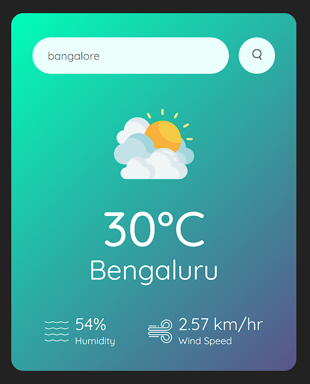
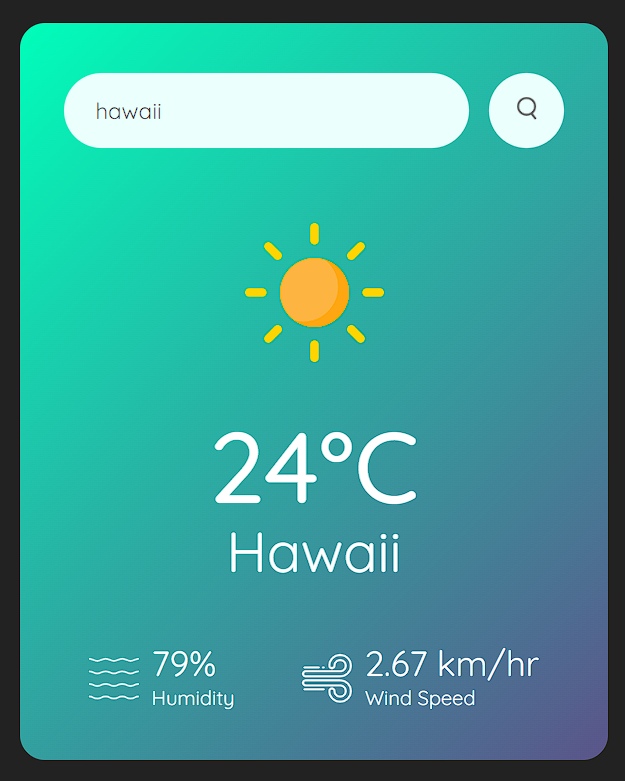

# Weather App

Welcome to the Weather App! This is a simple React application that allows users to search for the current weather information of a city.

## Screenshots

### First View


### Mostly Sunny Day


### Sunny Day


### Error


## Features

- **Search:** Enter the name of a city to get its current weather details.
- **Weather Icon:** Displays an appropriate weather icon based on the weather conditions.
- **Temperature:** Shows the current temperature in Celsius.
- **City Name:** Displays the name of the city for which weather information is shown.
- **Humidity:** Displays the humidity percentage.
- **Wind Speed:** Displays the wind speed in kilometers per hour.

## Installation

1. Clone the repository:

   ```bash
   git clone https://github.com/your-username/weather-app.git
   cd weather-app
   ```

2. Install the dependencies:

   ```bash
   npm install
   ```

3. Start the development server:

   ```bash
   npm start
   ```

   The app will be available at `http://localhost:3000`.

## Usage

1. Enter the name of a city in the search input and click the search button.
2. The app will fetch the current weather information for the entered city and display it.
3. If the city is not found, an error message will be shown.

## FAQ

#### 1. How do I use the Weather App?

Simply enter a city's name in the search input and click the search button. The app will display the current weather details, such as temperature, humidity, and wind speed, for the entered city. If the city isn't found, an error message will show.

#### 2. Is there any issue after polishing?

No, there are no errors. However, please note that the app has a limited set of weather icons. For example, it will show a snow icon for snowy weather and a rain icon for rainy weather. Due to icon availability and the API's limitations, some cities might not display specific icons.
